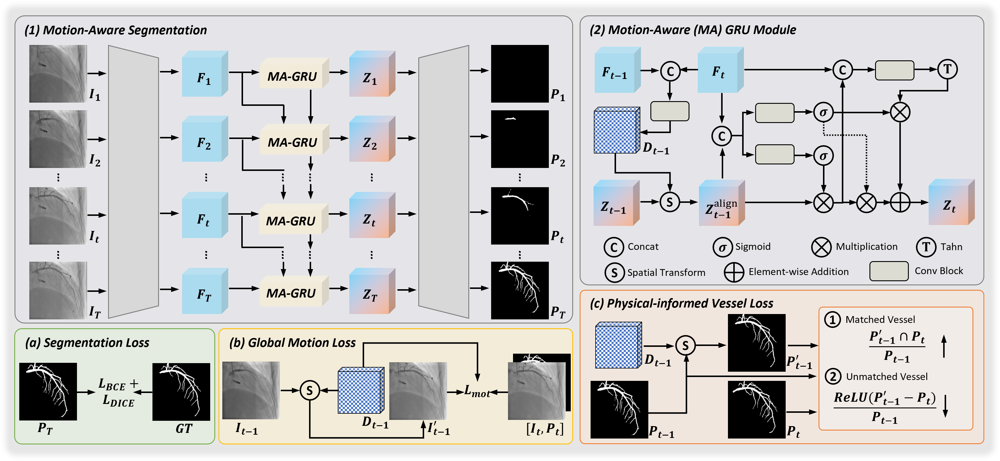

# MACOS: Weakly-Supervised Coronary Artery Segmentation from DSA Sequence via Motion-Aware Modeling

**[MICCAI 2026, early accept]** Official PyTorch implementation.

Han Wu, Xiaosong Xiong, Yanli Song, Yiqiang Zhan, Sean Zhou, Dijia Wu, Dinggang Shen
(ShanghaiTech University · Shanghai United Imaging Intelligence · Shanghai Clinical Research and Trial Center · Lingang Laboratory)

<p align="center"></p>

MACOS segments the coronary arteries on the key frame (maximal opacification) of a DSA injection sequence while using the whole, unlabeled injection process as context. It is weakly supervised: only the key frame carries a mask.

- **Motion-Aware GRU (MA-GRU).** At every scale of a shared U-Net encoder, a small motion estimator predicts the displacement field between consecutive frames, warps the previous hidden state onto the current frame, and only then applies the GRU gates, so temporal aggregation happens on motion-aligned features.
- **Global Motion Loss.** Masked photometric consistency on background (non-vessel) regions plus a smoothness prior on the finest displacement field, so motion is learned without any motion annotation.
- **Physics-Informed Vessel Loss.** Contrast wash-in makes the visible vessel tree grow monotonically. The loss warps the previous prediction forward and penalises vessel response that disappears, which regularises the intermediate, unlabeled frames.

## Repository layout

```
code/
├── train.py               # training (single- or multi-GPU)
├── test.py                # inference on a split + Dice / IoU / Precision / Recall / ASD on the key frame
├── models/
│   ├── motion_unet.py     # MACOS: warp(), MotionAwareGRUCell (MA-GRU), MotionAwareGRU, MotionEncoder, MotionUNet
│   └── unet.py            # U-Net blocks, encoder and per-frame decoder
├── dataloader/dsa_dataset.py
└── utils/
    ├── losses.py          # SegmentationLoss, MotionLoss (Global Motion Loss), PhysicsLoss (Physics-Informed Vessel Loss)
    ├── metrics.py         # training metrics and per-case evaluation metrics
    ├── lr_scheduler.py    # warm-up + cosine / polynomial schedule
    └── common.py          # seeding, logging, distributed helpers
scripts/                   # ready-to-run commands (see below)
assets/                    # figure for this README
```

## Installation

```bash
conda create -n macos python=3.10 -y
conda activate macos
pip install torch==2.3.1 --index-url https://download.pytorch.org/whl/cu121
pip install -r requirements.txt
```

## Data preparation

The DSA dataset used in the paper was collected at two clinical centers and cannot be redistributed. To run the code on your own data, store each sequence as a folder with two NIfTI volumes of identical shape `(T, H, W)`:

```
data/DSA_sequences/
├── data_splits.json          # {"train": ["case_0001", ...], "test": ["case_0101", ...]}
├── case_0001/
│   ├── video.nii.gz          # T frames of the injection, first frame = pre-injection, last frame = key frame
│   └── mask.nii.gz           # vessel masks with the same shape (non-zero = vessel); only the key frame is used
├── case_0002/
│   └── ...
```

## Training

All commands are run from the repository root. A run writes to `./results/<dataset name>/<run name>/` with `checkpoints/` (`best_model.pth`, `latest_model.pth`), `logs/`, `runs/` (TensorBoard) and `code/` (a copy of the code used for the run).

```bash
# MACOS with the settings used in the paper (T = 6 frames, lambda_1 = 0.3, lambda_2 = 0.5)
bash scripts/train_macos.sh ./data/DSA_sequences
```

The script expands to

```bash
python ./code/train.py \
    --data_dir ./data/DSA_sequences --frame_num 6 \
    --batch_size 4 --epochs 150 --num_workers 8 \
    --optimizer adamw --lr 3e-4 --weight_decay 1e-4 \
    --scheduler_type cosine --warmup_epochs 30 --min_lr_ratio 0.00005 \
    --augmentation --deep_supervision --mixed_precision \
    --focal_weight 0.8 --focal_alpha 0.25 --focal_gamma 2.0 \
    --reg_weight 0.3 --reg_type mask --filling_weight 0.5
```

Key options of `code/train.py` (numeric defaults follow the paper configuration; `--augmentation`, `--deep_supervision` and `--mixed_precision` are opt-in flags; `python code/train.py -h` lists everything):

| option | meaning |
| --- | --- |
| `--frame_num` | number of frames sampled per sequence (temporal configuration) |
| `--reg_weight` | λ1, weight of the Global Motion Loss (`MotionLoss`) |
| `--reg_type` | `mask`: photometric term on predicted background only; `normal`: on the whole frame |
| `--filling_weight` | λ2, weight of the Physics-Informed Vessel Loss (`PhysicsLoss`) |
| `--deep_supervision` | multi-scale supervision of the decoder |
| `--focal_weight`, `--focal_alpha`, `--focal_gamma` | focal term added to the CE + Dice key-frame loss (`--focal_weight 0` disables it) |
| `--scheduler_type`, `--warmup_epochs`, `--min_lr_ratio` | learning-rate schedule |
| `--val_split` | split of `data_splits.json` evaluated after every epoch to select `best_model.pth` (default `test`; add a `val` split to keep the test set untouched) |
| `--mixed_precision` | AMP training |
| `--resume`, `--init_weights` | resume a run / initialise from a checkpoint |

Multi-GPU training uses the standard `torchrun` environment variables:

```bash
torchrun --nproc_per_node=4 ./code/train.py <same arguments as above>
```

`EPOCHS`, `BATCH_SIZE`, `NUM_WORKERS`, `FRAME_NUM`, `REG_WEIGHT` and `FILLING_WEIGHT` can be overridden through environment variables, e.g. `EPOCHS=1 bash scripts/train_macos.sh` for a quick smoke test or `FRAME_NUM=12 bash scripts/train_macos.sh` for a different temporal sampling.

## Evaluation

```bash
bash scripts/test.sh <RUN_DIR> ./data/DSA_sequences test
# = python ./code/test.py --model_path <RUN_DIR> --data_dir ./data/DSA_sequences --split test
```

`test.py` loads `<RUN_DIR>/checkpoints/best_model.pth` (a checkpoint file can be passed instead; the frame count is read from it), writes the predicted sequences (`*_pred.nii.gz`) and ground truth to `<RUN_DIR>/inference/<split>/`, and reports per-case and mean (std) Dice, IoU, Precision, Recall and ASD of the key frame in `<RUN_DIR>/inference/metrics_<split>.{csv,txt}`. Add `--save_inputs` to also store the de-normalised input sequences.

## Citation

```bibtex
@inproceedings{wu2026macos,
  title     = {Weakly-Supervised Coronary Artery Segmentation from {DSA} Sequence via Motion-Aware Modeling},
  author    = {Wu, Han and Xiong, Xiaosong and Song, Yanli and Zhan, Yiqiang and Zhou, Sean and Wu, Dijia and Shen, Dinggang},
  booktitle = {Medical Image Computing and Computer Assisted Intervention (MICCAI)},
  year      = {2026}
}
```
